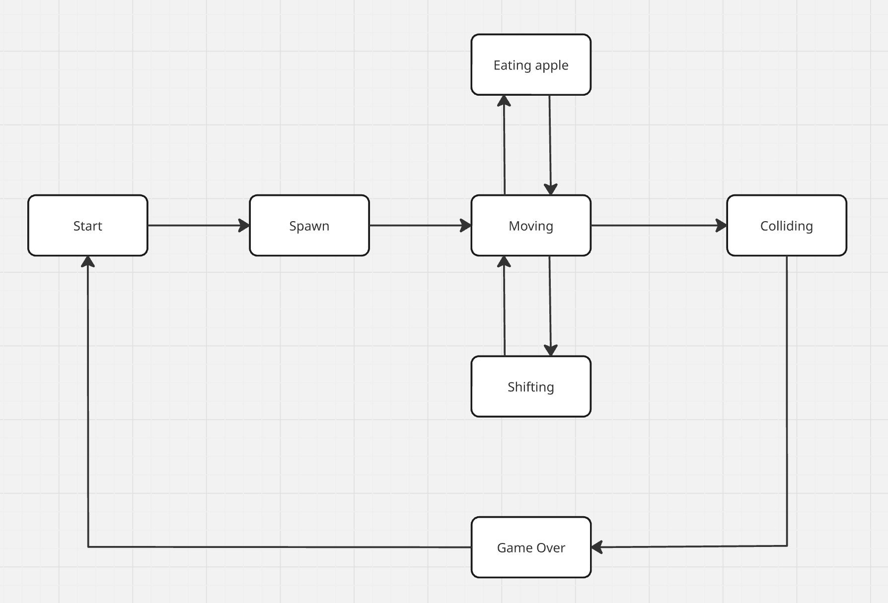

# BrickGame: Коллекция игр

## О проекте

BrickGame представляет собой коллекцию классических игр, реализованных с использованием модульной архитектуры. Проект включает две популярные игры:
- **Тетрис** (реализация на C)
- **Змейка** (реализация на C++)

Обе игры доступны через:
1. Консольный интерфейс (CLI) с использованием ncurses
2. Графический интерфейс (Qt) для десктопных систем

## Особенности реализации

### Архитектура
- **Модульная система**: Каждая игра реализована как независимая библиотека
- **Единый API**: Стандартизированный интерфейс для взаимодействия с играми
- **MVC-паттерн**: Четкое разделение логики (Model), отображения (View) и управления (Controller)
- **Кросс-платформенность**: Поддержка Linux и macOS

### Технические характеристики
| Компонент       | Технологии                     |
|-----------------|--------------------------------|
| Языки           | C (Tetris), C++ (Snake)        |
| Стандарты       | C11, C++20                     |
| GUI фреймворк   | Qt 5.15+                       |
| CLI библиотека  | ncurses                        |
| Тестирование    | Check (C), Google Test (C++)   |
| Сборка          | Makefile + CMake               |

## Игровая механика

### 🧱 Тетрис
- 7 классических фигур с вращением
- Система уровней (10 уровней сложности)
- Динамическая скорость падения
- Подсчет очков за собранные линии
- Сохранение рекордов между запусками

### 🐍 Змейка
- Плавное движение с изменением направления
- Увеличение длины при сборе яблок
- 10 уровней с возрастающей скоростью
- Победа при достижении длины 200
- Система очков и рекордов

## Техническая реализация

### Единый игровой API
```c
typedef enum {
    Start,
    Pause,
    Terminate,
    Left,
    Right,
    Up,
    Down,
    Action
} UserAction_t;

typedef struct {
    int **field;        // Игровое поле 10x20
    int **next;         // Предпросмотр следующего элемента
    int score;          // Текущий счет
    int high_score;     // Рекорд
    int level;          // Текущий уровень
    int speed;          // Скорость игры
    int pause;          // Флаг паузы
} GameInfo_t;

// Функции для взаимодействия с игрой
void userInput(UserAction_t action, bool hold);
GameInfo_t updateCurrentState();
```

### Структура проекта
```
src/
├── brick_game/
│   ├── snake/          # Логика змейки (C++)
│   └── tetris/         # Логика тетриса (C)
├── gui/
│   ├── desktop/        # Qt-интерфейс
│   └── cli/            # Консольный интерфейс (ncurses)
tests/                  # Unit-тесты
```

### Конечные автоматы
**Тетрис**:


Данный КА состоит из следующих состояний:

- Старт — состояние, в котором игра ждет, пока игрок нажмет кнопку готовности к игре.
- Спавн — состояние, в которое переходит игра, при создании очередного блока и выбора следующего блока для спавна.
- Перемещение — основное игровое состояние с обработкой ввода от пользователя — поворот блоков / перемещение блоков по горизонтали.
- Сдвиг — состояние, в которое переходит игра после истечения таймера. В нем текущий блок перемещается вниз на один уровень.
- Соединение — состояние, в которое переходит игра, после «соприкосновения» текущего блока с уже упавшими или с землей. Если образуется заполненные линии, то она уничтожается, и остальные блоки смещаются вниз. Если блок остановился в самом верхнем ряду, то игра переходит в состояние «игра окончена».
- Игра окончена.

**Змейка**:


Данный КА состоит из следующих состояний:

- Старт — состояние, в котором игра ждет, пока игрок нажмет кнопку готовности к игре.
- Спавн — состояние, в которое переходит игра, при выставлении змейки на начальное место и выставлении яблока относительно него.
- Перемещение — основное игровое состояние с обработкой ввода от пользователя — изменением направления змейки или ускорением.
- Сдвиг — состояние, в которое переходит игра после истечения таймера. В нем змейка сама перемещается на одну клетку.
- Поедание яблока — состояние, в которое переходит игра, когда перед головой змеи оказывается яблоко, в этом состоянии змейка растет на один блок и происходит спавн нового яблока.
- Столкновение — состояние, в которое переходит игра, когда перед головой змеи оказывается стена или другая часть змеи, состояние сразу переходит в «игра окончена».
- Игра окончена.

## Установка и запуск

### Требования
- Компилятор: gcc (C) / g++ (C++)
- Зависимости: ncurses, Qt5 Core + Gui + Widgets
- Тестирование: Check, Google Test

### Сборка и установка
```bash
# Клонирование репозитория
git clone https://github.com/your-username/BrickGame.git
cd BrickGame/src

# Сборка проекта
make all

# Установка
make install

# Запуск консольной версии
make run_cli

# Запуск графической версии (Qt)
make run_gui
```

### Запуск через Docker
```bash
docker pull alpine:3.20
sh docker_run.sh
make install_cli
make run_cli
```

## Управление

### Общие команды
| Клавиша | Действие          |
|---------|-------------------|
| `Esc`   | Выход из игры     |
| `P`     | Пауза/продолжение |
| `Enter`      | Старт игры        |

### Тетрис
| Клавиша      | Действие          |
|--------------|-------------------|
| `←` `→` `↓`  | Движение фигуры   |
| `Space`      | Вращение фигуры   |


### Змейка
| Клавиша      | Действие          |
|--------------|-------------------|
| `←` `→` `↑` `↓` | Управление змейкой |
| `Зажатие стрелки`      | Ускорение         |

## Тестирование
```bash
# Запуск unit-тестов
make test

# Генерация отчетов о покрытии
make gcov_report
```

**Покрытие тестами:**
- Оба: >80%
- Основные тестируемые компоненты:
  - Логика движения/вращения
  - Система подсчета очков
  - Переходы состояний
  - Обработка столкновений

## Результаты

[Скриншоты](result.md)

